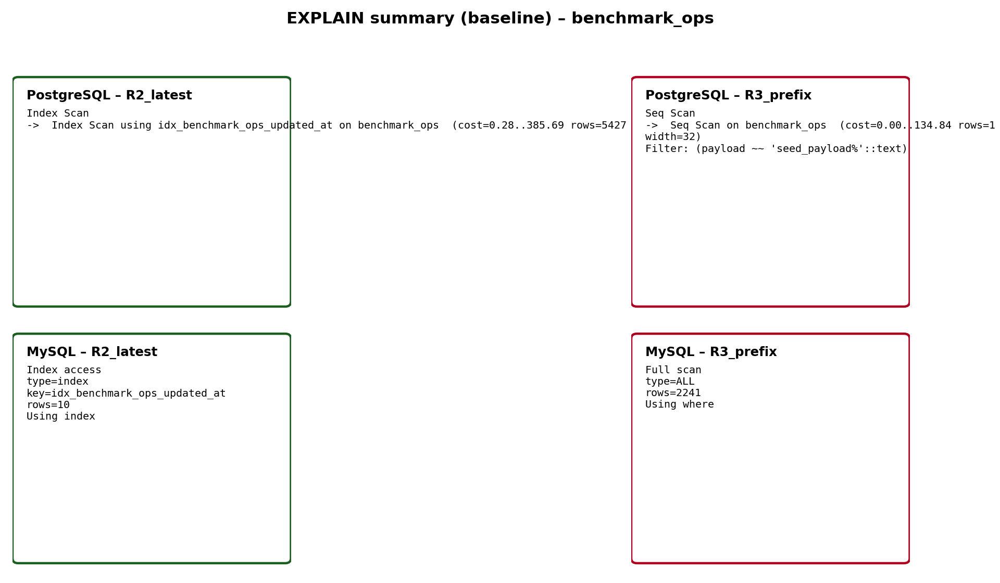

# Analiza planów zapytań (EXPLAIN)

Poniższa analiza opisuje plany zapytań zapisane automatycznie przez aplikację w pliku [data/results/explain_20260425_093610.json](../data/results/explain_20260425_093610.json) dla uruchomienia `run_id=20260425_093610` w trybie `baseline`.

## Jakie zapytania są analizowane
Wyniki EXPLAIN są zapisane dla dwóch przykładowych odczytów używanych w benchmarku `benchmark_ops`:
- **R2_latest**: odczyt „najnowszych” rekordów (sortowanie po `updated_at` malejąco i `LIMIT 10`).
- **R3_prefix**: odczyt rekordów po prefiksie `payload` (warunek typu `payload LIKE 'seed_payload%'` i `LIMIT 20`).

W pliku EXPLAIN sekcje **MongoDB** i **ScyllaDB** są puste, ponieważ w obecnej wersji aplikacji próbki planów są zbierane metodą `explain_samples()` tylko dla PostgreSQL i MySQL.

## PostgreSQL – interpretacja planów
### R2_latest
Plan ma postać **Index Scan** po indeksie `idx_benchmark_ops_updated_at`, a następnie ograniczenie `LIMIT`.
W praktyce oznacza to, że silnik może czytać rekordy już w kolejności zgodnej z indeksem (po `updated_at DESC`), więc pobranie „ostatnich” 10 wierszy nie wymaga pełnego skanowania tabeli.

### R3_prefix
Plan pokazuje **Seq Scan** (skan sekwencyjny) z filtrem `payload LIKE 'seed_payload%'`.
To typowe dla trybu `baseline`, gdzie nie ma dodatkowego indeksu wspierającego wyszukiwanie po prefiksie `payload`. Efektem jest konieczność przejrzenia większej części tabeli i odfiltrowania dopasowań, co zwykle podnosi koszt odczytu.

## MySQL – interpretacja planów
### R2_latest
W EXPLAIN widać użycie klucza `idx_benchmark_ops_updated_at` oraz typ dostępu `index` z `rows=10` i `Extra=Using index`.
To wskazuje, że MySQL potrafi zrealizować zapytanie „po indeksie”, bez pełnego skanowania tabeli.

### R3_prefix
EXPLAIN pokazuje typ dostępu `ALL` (pełny skan tabeli) i `Extra=Using where`.
W trybie `baseline` oznacza to, że warunek prefiksowy na `payload` jest realizowany przez filtrowanie wierszy po wczytaniu, zamiast przez selektywny odczyt z indeksu.

## Wnioski
- Zapytanie typu „latest + LIMIT” (**R2_latest**) korzysta z indeksu po `updated_at` i jest naturalnie zoptymalizowane przez silnik.
- Zapytanie po prefiksie (**R3_prefix**) w trybie `baseline` wykonuje skan pełny (MySQL) / sekwencyjny (PostgreSQL), co jest spójne z brakiem indeksu po `payload`.
- W trybie `after-index` aplikacja tworzy indeks po `payload` (prefiks/pattern) tam, gdzie to wspierane, co powinno przełożyć się na zmianę planu dla zapytań typu R3 (zamiast skanu pełnego → dostęp indeksowy).

## Grafika
Wygenerowana grafika porównująca plany dla `baseline`:

